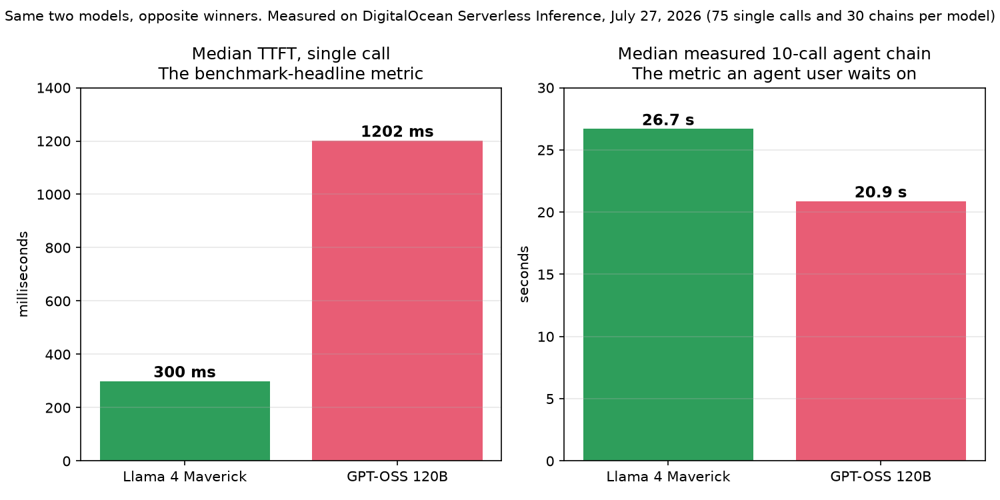
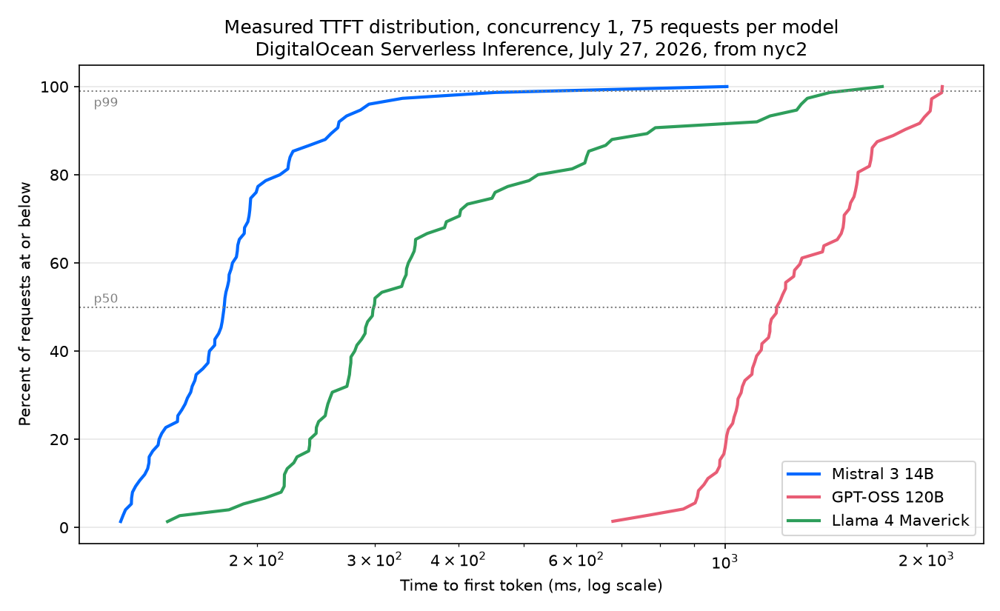
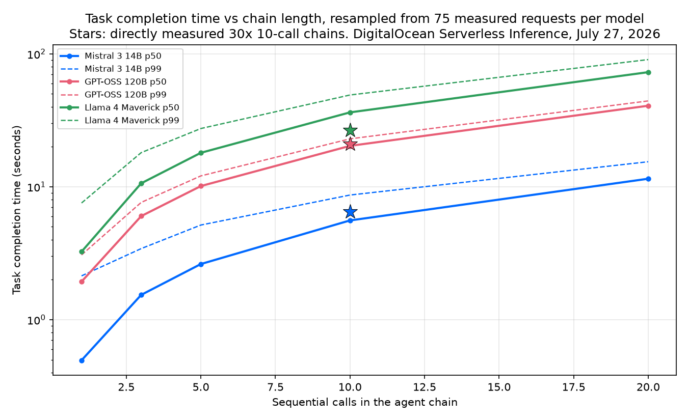
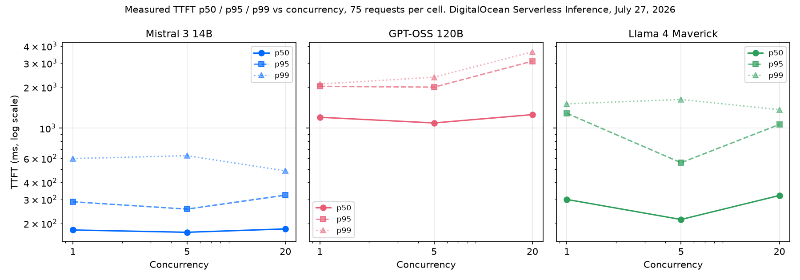

# Why Your P50 Latency Doesn't Matter: Measured Evidence from Serverless Inference

**A reproducible latency study of four models on DigitalOcean Serverless Inference, measuring what single-call benchmarks report versus what agent workloads actually experience.**

- **Run date:** July 27, 2026, 08:39–11:07 UTC (one time window)
- **Endpoint:** `https://inference.do-ai.run/v1` ([DigitalOcean Serverless Inference](https://docs.digitalocean.com/products/inference/how-to/use-serverless-inference/))
- **Client:** DigitalOcean GPU Droplet (`gpu-h200x1-141gb`, 24 vCPUs), NYC2 region, cloud-internal network path
- **Volume:** 1,590 recorded requests across four models, zero failed requests
- **Everything in this repository is what actually ran:** the harness, the raw per-request JSON, the console logs, the analysis code, and the charts it produced.

This repository is the evidence base for a companion article, *"Why Your P50 Latency Doesn't Matter: A Practitioner's Framework for Evaluating Inference Latency Claims"* (DigitalOcean Community, forthcoming).

---

## Abstract

Published inference benchmarks lead with a median: a p50 time to first token (TTFT) or a peak tokens-per-second figure. This study measures why that number is a poor predictor of production experience, using two complementary tests against a live serverless inference endpoint: a **single-call baseline** (75 streamed requests per cell at concurrency 1, 5, and 20) and a **chained agent test** (30 independent chains of 10 sequential calls, each call's output feeding the next call's input).

The headline result is a **metric inversion measured on live infrastructure**: the model that won the single-call TTFT comparison by 4x (Llama 4 Maverick, 300 ms median, vs GPT-OSS 120B, 1,202 ms) **lost the measured 10-call agent task** by 28% at the median (26.7 s vs 20.9 s) and 84% at p95 (53.1 s vs 28.8 s). The run also captured, unplanned, two tail pathologies that median-led benchmarks structurally cannot show: a **stalled stream** that delivered its first token in 321 ms and then took 19.8 minutes to complete (turning one 10-call chain into a 20.4-minute task), and a model serving at **1.6 tokens/second** whose reasonable-looking 2.1 s median TTFT concealed 43.5 s median total completion time for 64 tokens.

The conclusion is methodological, not a leaderboard: **the metric that predicts your experience depends on your workload's shape**. For streaming chat, TTFT percentiles matter. For agent pipelines, task completion time — the sum across every sequential call — is the correct unit of analysis, and it can rank models in the opposite order from the benchmark-headline number.

---

## Key findings

### 1. The benchmark winner lost the task

| Measured, single call (75 requests, concurrency 1) | Llama 4 Maverick | GPT-OSS 120B |
| --- | --- | --- |
| TTFT, p50 | **300 ms** | 1,202 ms |
| Total completion time, p50 | 3,249 ms | **1,933 ms** |
| Total completion time, p99 | 7,458 ms | **2,932 ms** |
| Median generation speed | 21 tokens/s | **86 tokens/s** |

| Measured, 10-call agent chain (30 chains) | Llama 4 Maverick | GPT-OSS 120B |
| --- | --- | --- |
| Task completion time, p50 | 26.7 s | **20.9 s** |
| Task completion time, p95 | 53.1 s | **28.8 s** |
| Worst measured chain | 1,221.6 s (20.4 min) | **31.8 s** |



*Each panel asks "which model is faster?" with a different clock. Left: milliseconds to first token of a single reply (the benchmark-headline metric). Right: seconds to finish a complete 10-step agent task (the metric an agent's user waits on). Nothing changed between panels except which clock you trust.*

### 2. Distribution shape, not the median, is the story

| Model | Total p50 | Total p95 | Total p99 | p99:p50 | CV | Median gen speed |
| --- | --- | --- | --- | --- | --- | --- |
| Mistral 3 14B | 495 ms | 1,153 ms | 1,839 ms | 3.72 | 50% | 202 tokens/s |
| GPT-OSS 120B | 1,933 ms | 2,689 ms | 2,932 ms | 1.52 | 15% | 86 tokens/s |
| Llama 4 Maverick | 3,249 ms | 7,002 ms | 7,458 ms | 2.30 | 43% | 21 tokens/s |



*Each line is 75 real requests at concurrency 1. Read any point as "this share of requests (y) got a first token within this time (x)." A near-vertical line means predictable latency. A long shallow slope to the right is a tail — most requests are quick, the last few percent wait far longer. Mistral 3 14B (blue) is fast and tight; Llama 4 Maverick (green) starts fast and spreads wide; GPT-OSS 120B (red) starts slow and stays put.*

### 3. Task time compounds with chain length



*Solid lines: median task time, resampled (bootstrap, seed 42, 100,000 trials) from each model's 75 measured single-call latencies. Dashed lines: p99. Stars: directly measured 30x 10-call chain medians. The y-axis is logarithmic. The gap between models dwarfs the gap between any model's median and its own tail — model and serving choice dominate — and the stars confirm the ordering the resampled lines predict.*

### 4. Concurrency stretches tails before it moves medians



*One panel per model; lines are p50 (solid), p95 (dashed), p99 (dotted) as in-flight requests rise from 1 to 20. Medians stay roughly flat; the p50-to-p99 spread is what widens (visible for GPT-OSS 120B at concurrency 20). This is the mechanism by which a provider's concurrency-1 benchmark and your production experience quietly part ways.*

### 5. Two tail pathologies, caught live

- **The stalled stream.** One of Llama 4 Maverick's 300 chain calls delivered its first token in 321 ms — an excellent TTFT — then trickled for 19.8 minutes before completing. Every headline metric would have scored that request favorably at the moment it started. It is visible in `logs/bench_run.log` as the `1221603 ms` chain and in `data/results_llama-4-maverick.json` as chain 11, call 0.
- **The famous model that couldn't finish the protocol.** `llama3.3-70b-instruct` served at ~1.6 tokens/s during this window; its first 75-request cell was terminated after 76 minutes, and a bounded follow-up (15 sequential requests, hard 150 s cap, incremental writes) measured 43.5 s median total time for 64 tokens, with two requests waiting 37 s and 68 s for their first token. Its median TTFT — 2.1 s — looked unremarkable. The number that told the truth was total completion time.

---

## Methodology

**Protocol, per model:**

1. **Single-call baseline:** 75 streamed chat completions per cell at concurrency 1, 5, and 20 (real OS-thread pool, not a single-process asyncio loop, to avoid the client-side measurement bias described in [arXiv 2605.24217](https://arxiv.org/pdf/2605.24217)). Fixed short prompt, `temperature` 0, `max_tokens` 64, `stream` on with usage reporting.
2. **Chained agent test:** 30 independent chains of 10 sequential calls, each call's output appended to the conversation history of the next. Chain-level totals recorded directly, not reconstructed from per-call numbers.

**Measured per request:** client-side TTFT (first *content* token), total completion time, prompt/completion token counts, full response text. Every raw record is in `data/`.

**Models tested:** `mistral-3-14B`, `openai-gpt-oss-120b`, `llama-4-maverick` (full protocol, 525 requests each); `llama3.3-70b-instruct` (bounded follow-up, 15 requests — see above).

**Known limitations, stated plainly:**

- One time window (early morning US Eastern, a low-traffic period), one client location, one day. These numbers describe what this endpoint did during that window, not a daily average and not your workload.
- The cloud-internal network path understates public-internet latency (and *is* the realistic path if your application runs in the same cloud).
- Output capped at 64 tokens; answer **quality was not evaluated** — these results must not be read as "model X is better than model Y."
- TTFT is defined as time to first content token: 14 GPT-OSS 120B responses spent their whole token budget on internal reasoning and have totals but no TTFT.
- The bootstrap chain-length curves assume independent, stationary single-call draws; directly measured chains are the ground truth wherever the two disagree.

---

## Repository layout

```
harness/
  do_latency_bench.py        The measurement harness (stdlib only). This is the script that ran.
  llama_bounded_sweep.py     Bounded follow-up for the stalling model (150 s cap, incremental writes).
  run_all_benchmarks.sh      Orchestration for the July 27, 2026 run.
analysis/
  analyze_results.py         Recomputes every table and chart from the raw data (numpy + matplotlib).
data/
  results_<model>.json       Raw per-request records: TTFT, totals, tokens, full text. Untouched.
  bounded_llama3.3-70b-instruct.jsonl
logs/
  bench_run.log              Complete console output of the main run.
  llama_bounded.log          Complete console output of the bounded follow-up.
charts/
  *.png                      The four measured charts, generated by analysis/analyze_results.py.
```

## Reproducing

Against the archived data (no account needed):

```bash
pip install -r requirements.txt
python3 analysis/analyze_results.py --data-dir data --charts-dir charts
```

This reprints every table and regenerates every chart from the raw JSON.

Against live infrastructure (your own numbers, which are the ones that matter):

```bash
# 1. Create a model access key in the DigitalOcean Cloud Console:
#    https://docs.digitalocean.com/products/inference/how-to/manage-model-access-keys/
# 2. Confirm a positive prepaid balance (Serverless Inference is billed per token):
#    https://docs.digitalocean.com/products/inference/details/pricing/
# 3. List models and pick an exact ID:
curl -s -H "Authorization: Bearer $DO_MODEL_ACCESS_KEY" https://inference.do-ai.run/v1/models

# 4. Run the harness (stdlib only, nothing to install):
export DO_MODEL_ACCESS_KEY=your_key_here
python3 harness/do_latency_bench.py --model <model-id> --out results_daytime.json
```

Run it once during business hours and once overnight — this study only covered one window, and the second window is the part of the protocol it did not execute. If your results differ from anything reported here, that difference is the finding.

Note on paths: `harness/llama_bounded_sweep.py` and `harness/run_all_benchmarks.sh` reference `/root/...` paths because they are preserved exactly as they ran on the droplet; adjust the paths if you run them elsewhere.

## Citation

If you use this data or method, please cite:

```
Anish Singh Walia (2026). Why Your P50 Latency Doesn't Matter: Measured Evidence
from Serverless Inference. https://github.com/anishsingh20/serverless-inference-tail-latency-study
```

## License

MIT. See [LICENSE](LICENSE).
